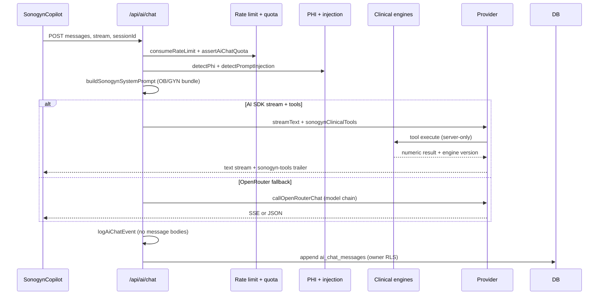

# AI Architecture — SonoGyn Pro

## Scope

Sonogyn AI Copilot (`/api/ai/chat`, `SonogynCopilot.tsx`) — clinical decision support for ultrasound (OB/GYN).  
Patterns inspired by **Vercel AI SDK** and Chatbot architecture; **not** a template fork. Supabase Auth, DB, and UI design remain unchanged.

## Stack

| Layer | Implementation |
|-------|----------------|
| Provider | OpenRouter (vision), Perplexity (text) via `lib/ai/llm-provider.ts` |
| Streaming | Vercel AI SDK `streamText` (opt-in `AI_SDK_ENABLED`) + OpenRouter SSE fallback |
| Tools | AI SDK tools → local engines (`@repo/orads-us`, `@repo/birads-us`, `@repo/tirads-acr`, `@repo/fmf`) |
| Evidence | `@repo/evidence-retrieval` + `synthesizeWithLlm` (EBM mode) |
| Persistence | `ai_chat_sessions`, `ai_chat_messages`, `ai_chat_events` (metadata only in events) |
| Security | PHI gate, prompt-injection heuristics, rate limits, server tool ACL |

## Request flow

## Prompt versioning

- Registry: `lib/ai/sonogyn-chat/prompt-registry.ts`
- Bundles: **gynecology** | **obstetric** | **general**
- Version label stored in `ai_chat_events.prompt_version` and `ai_chat_messages.prompt_version`

## Model fallback

- Chain: `buildModelFallbackChain()` — requested → primary → `AI_CHAT_FALLBACK_MODEL` → default
- Client header: `X-Sonogyn-Model-Fallback: 1`

## Cost control

- Free tier: `assertAiChatQuota()` counts successful `ai_chat_events` (30 days)
- Telemetry: `estimated_cost_usd` from token usage (rough, not billing)

## Privacy

- No patient identifiers sent to model (PHI block)
- `redactForAiLog()` before diagnostic logs
- Sentry scrub extended for `messages`, `content`, `prompt`
- `ai_chat_events` — metadata only (tokens, model, duration)

## Feature flags

| Env | Effect |
|-----|--------|
| `AI_SDK_ENABLED=1` | Server uses AI SDK stream path |
| `NEXT_PUBLIC_AI_SDK_ENABLED=1` | Client parses plain text AI SDK stream |
| `AI_CHAT_FALLBACK_MODEL` | Secondary model id on provider errors |
| `EVIDENCE_CLINICAL_HINTS=1` | Append PubMed/CR hints in clinical mode |

## Key files

- `apps/web/app/api/ai/chat/route.ts`
- `apps/web/lib/ai/sdk/stream-chat.ts`
- `apps/web/lib/ai/sonogyn-chat/tools/*`
- `apps/web/components/ai/SonogynCopilot.tsx`
- `apps/web/supabase/migrations/20260830180000_ai_assistant_hardening.sql`
