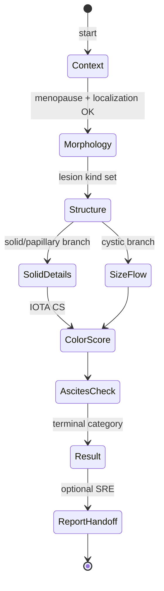

# SonoGyn Pro — Master Architecture (Blocks 1–4)

> Architecture only · No code · STEP 3

---

# БЛОК 1 — ВРАЧ-ПРАКТИК

## 1.2 O-RADS Navigator

### Analysis (existing)

| Asset | Location |
|-------|----------|
| Decision tree | `packages/orads-us/src/oradsDecisionTree.ts` |
| Tree walker | `packages/orads-us/src/treeWalker.ts` |
| Web calculator | `apps/web/components/calculators/orads/OradsProCalculator.tsx` |
| Mobile wizard | `apps/mobile/src/features/oradsWizard/` |
| Legacy calc | `apps/mobile/.../oradsCalculator.ts` (duplicate — deprecate) |

### Architecture

**Product name:** O-RADS Navigator  
**Package:** extend `@repo/orads-us` → export `OradsNavigator` API

```
OradsNavigatorState {
  path: OradsTreePathStep[]
  currentNodeId: string
  draftInput: Partial<OradsInput>
  locale: 'ru' | 'en'
}
```

### State machine



| State | Entry | Exit guard |
|-------|-------|------------|
| Context | root | menopause + ovary/adnex |
| Morphology | structure Q | all required morphology |
| ColorScore | blood flow / CS | score 1–4 |
| Result | walkOradsDecisionTree ok | category 1–5 |

### Database schema (navigator sessions)

```sql
orads_navigator_sessions (
  id uuid PK,
  user_id uuid,
  study_id uuid NULL,
  path_json jsonb,
  result_json jsonb,
  status text, -- in_progress | completed
  created_at, updated_at
)
-- RLS: auth.uid() = user_id
```

Optional v1: **localStorage only**; Supabase sync in v1.1.

### UI flow

**Web:** `/calculators/o-rads` → wizard mode toggle (exists partially) → stepper + help panel + atlas link  
**Mobile:** `OradsWizardScreen` — unify with `@repo/orads-us` tree (replace legacy calculator path)

### Shared package design

```
@repo/orads-us/
  navigator/
    stateMachine.ts      -- pure transitions
    useOradsNavigator.ts -- headless hook (web + mobile)
    locales/             -- tree i18n keys (collectOradsTreeLocaleKeys)
  index.ts               -- walkOradsDecisionTree, OradsNavigator
```

### Recommendations output

Reuse `oradsManagementForCategory` + handoff to SRE (`structured_reporting.md`).

---

## 1.3 IOTA Navigator

### Analysis (existing)

| Asset | Location |
|-------|----------|
| IOTA Simple Rules | `packages/adnex-education/ozerskaya-iota.ts` |
| Triangulation O-RADS↔IOTA | `adnex-consensus.ts` |
| IOTA 2026 terms + quiz | `apps/web/lib/education/iota-terms-2026/` |
| Color score in O-RADS form | `useOradsProForm.ts` |

### Architecture

**IOTA Navigator** = parallel wizard to O-RADS for **IOTA Simple Rules + 2026 lexicon**.

```
@repo/iota-navigator (NEW, or submodule of adnex-education)
  ├── simpleRulesEngine.ts    -- B1-M5 evaluation
  ├── terms2026Engine.ts      -- solid, papillary, CS
  ├── triangulation.ts        -- wrap adnex-consensus
  └── navigatorStateMachine.ts
```

### State machine (simplified)

```
LesionPresent → UnilocularCyst? → SolidComponent? → Papillary? 
  → ColorScore → SimpleRulesTally → Verdict(benign|malignant|inconclusive)
  → TriangulateWithOrads → Pitfalls[]
```

### Database

Reuse `calculator_entries` with `calculator_id = 'iota-navigator'` OR joint session with `orads_navigator_sessions.triangulation_json`.

### UI flow

- Web: tab inside `/calculators/o-rads` — «IOTA» | «O-RADS» | «Согласование»
- Mobile: stack screen after O-RADS wizard

---

## 1.4 Case Library Platform

### Analysis (existing)

| Asset | Location |
|-------|----------|
| `cases` table | `20260208100000_saas_platform_core.sql` |
| `case_media` | images/video paths |
| Social | `teaching_case_comments`, likes, bookmarks |
| Storage RLS | `20260605120000_teaching_case_media_storage.sql` |
| Web UI | `/cases`, `/community` |
| Realtime | `20260605140000_community_realtime.sql` |

### Architecture

```
┌──────────────────────────────────────────┐
│ Case Library Platform                     │
├──────────────────────────────────────────┤
│ Ingestion → Moderation → Publication      │
│ Search (tags, O-RADS, IOTA, BI-RADS)     │
│ Discussion + Expert review                │
└──────────────────────────────────────────┘
```

### Extended schema (additive migration)

```sql
-- extend cases (nullable columns, backward compatible)
alter table cases add column if not exists
  orads_category smallint,
  iota_verdict text,
  birads_category text,
  pathology_tags text[],
  expert_reviewer_id uuid references auth.users,
  search_vector tsvector; -- generated

case_references (
  id uuid PK,
  case_id uuid FK,
  corpus_id text,
  label text,
  url text
)

case_discussion_posts -- rename/extend teaching_case_comments if needed
```

### Roles

| Role | Capabilities |
|------|--------------|
| doctor | create draft, comment, bookmark |
| expert | review queue, approve, annotate |
| moderator | flag, unpublish, RBAC `moderator` |
| admin | full |

### Search

- Postgres FTS on `title`, `description`, `pathology_tags`
- Filters: `orads_category`, `anatomy`, `difficulty`
- Future: Supabase pgvector on embedding of description

### API

```
GET  /api/cases?tags=&orads=&q=
POST /api/cases
PATCH /api/cases/[id]/publish  (moderator)
POST /api/cases/[id]/media/sign  (upload)
GET  /api/cases/[id]/discussion
```

### Mobile flow

- Cases tab → list → detail (gallery + classification badges) → comment
- Upload: Expo ImagePicker → signed URL → `case_media`

---

# БЛОК 2 — СТУДЕНТ

## 2.1 Learning Center

### Analysis (existing)

| Asset | Location |
|-------|----------|
| Career ladder | `apps/web/lib/career/ladder.ts` |
| Library catalog | `apps/web/lib/education/library-catalog.ts` |
| Courses API | `/api/courses`, author module |
| Basic course | `BasicCourseWidget.tsx` |
| Cervix / IOTA modules | packages + web clients |
| Atlas pages | ovary-atlas, breast-us, fetal-spine |

### Learning architecture

```
Learning Center
├── Tracks (Gyn | Obs | Breast | Fetal)
│   └── Modules → Lessons → Assets
├── Levels (Beginner | Intermediate | Expert)
└── Progress (per user, per module)
```

### Progress tracking

```sql
learning_progress (
  user_id, track_id, module_id,
  level text,
  completed_lessons uuid[],
  quiz_scores jsonb,
  last_accessed_at
) -- RLS owner
```

Bridge to existing `user_enrollments` / course progress APIs.

### Knowledge graph (conceptual)

```
Nodes: Guideline, Term (IOTA), Classification (O-RADS), Anatomy, Case
Edges: prerequisite | illustrates | assesses
Store: json in packages/clinical-guidelines/graph.json (v1 static)
UI: `/library/map` interactive (phase 2)
```

### Web experience

`/library` hub → track cards → module path → lesson → quiz CTA  
Persona `learner`: hide patient EMR nav, emphasize courses + atlas.

### Mobile experience

New `LibraryStack`: courses list → lesson WebView/offline markdown → quiz

---

## 2.2 AI Tutor

### Modes

| Mode | Behavior |
|------|----------|
| Explain | Answer question with citations |
| Teach | Socratic step-by-step |
| Quiz | Generate MCQ from lesson |
| Exam | Timed multi-topic assessment |
| Clinical reasoning | Case vignette → differential |

### System design

```
Client → /api/ai/tutor
  → TutorOrchestrator
      → mode router
      → difficulty adapter (student | resident | doctor)
      → RAG (@repo/evidence-corpus)
      → LLM (OpenRouter, existing infra)
      → Zod TutorResponseSchema
  → progress log (learning_progress)
```

### Prompt architecture

```
system: role + persona + safety + guideline-only
context: current lesson id, user level, past mistakes
tools: search_evidence, get_quiz_bank (read-only)
output: structured JSON (answer, citations, followUpQuestions)
```

### Difficulty adaptation

- Track error rate in `learning_progress.quiz_scores`
- Map career stage + explicit level → prompt temperature + question depth

---

## 2.3 Ultrasound Atlas 2.0

### Analysis (existing)

- Static atlases: ovary, breast, uterus 3D, fetal spine cards
- IDEA anatomical diagram component
- `@repo/clinical-3d`, `@repo/obstetric-atlas`

### Architecture

```
@repo/atlas-platform (NEW)
  collections/     -- manifest JSON per collection
  annotations/     -- normalized { x, y, label, pathologyId }
  compare/         -- before/after, side-by-side
  viewers/         -- web canvas + mobile gesture layer
```

### User types

| Type | Features |
|------|----------|
| student | labels visible, guided tour, TTS |
| doctor | hide hints, measure tools, link to SRE |

### Storage

- Images: Supabase storage `atlas-media/` (public read, admin write)
- Annotations: JSON in DB `atlas_annotations (collection_id, slide_id, data jsonb)`

---

# БЛОК 3 — САМОПРОВЕРКА

## 3.1 Examination System

### Analysis (existing)

- `SelfAssessmentWidget` + `quiz-bank-types.ts`
- Cervix + IOTA quiz banks in packages
- Progress: **localStorage only**

### Architecture

```
@repo/examination-engine (NEW)
  ├── banks/           -- import quiz JSON
  ├── session/         -- attempt lifecycle
  ├── scoring/         -- MCQ, image, case, drag-drop adapters
  └── certification/   -- pass thresholds, badges
```

### Modes

| Mode | Duration | Scoring |
|------|----------|---------|
| quick test | 5–10 Q | immediate |
| certification | 50 Q, timed | proctored-lite (honor) |
| mock exam | full blueprint | weighted by topic |

### Database

```sql
exam_blueprints (id, title, question_ids[], passing_score, time_limit_min)
exam_attempts (id, user_id, blueprint_id, answers jsonb, score, started_at, finished_at)
exam_certificates (user_id, blueprint_id, issued_at, expires_at)
-- RLS: owner; certificates readable by owner
```

### Question types (plugin interface)

```typescript
// conceptual — not code
QuestionAdapter { type, validateAnswer, score, renderHint }
```

---

## 3.2 Daily Image Challenge

### Workflow

```
DailyChallengeService
  → pick image from atlas/cases (moderator curated pool)
  → present MCQ diagnosis
  → reveal explanation + link to atlas
  → update streak + leaderboard
```

### Database

```sql
daily_challenges (date, case_id, question jsonb, difficulty)
daily_challenge_attempts (user_id, date, correct, time_ms)
leaderboard_view (materialized weekly)
```

### Gamification

- Streaks: consecutive days
- Leaderboard: opt-in display name from profile
- Difficulty: bucket by user exam history

---

# БЛОК 4 — CLINICAL DECISION ENGINE (CDE)

### Analysis (existing)

- `adnex-consensus` triangulation
- `analyzeOvaryUltrasoundAssist`, `analyzeNosologyUltrasoundAssist`
- `services/us-ai-worker` multi-agent pipeline
- Evidence workspace

### Architecture (differentiator)

```
Input: UltrasoundFindingsNormalized (Zod)
  │
  ├─► ClassificationEngine (O-RADS, IOTA, BI-RADS, TI-RADS plugins)
  ├─► DifferentialEngine (rule + LLM assist)
  ├─► RiskEngine (ROM A, ADNEX MM — future)
  ├─► RecommendationEngine (guideline paths)
  └─► EvidenceLinker
  │
Output: ClinicalDecisionPackage {
  classifications[], differential[], risks[], recommendations[], citations[]
}
```

### Placement

**Package:** `@repo/clinical-decision-engine`  
**Phase 3** — after SRE + navigators stabilize inputs.

### Integration

- SRE consumes CDE output as optional «smart fill»
- **Not** auto-diagnosis — physician confirms each block

---

# Cross-cutting: Shared packages roadmap

| Package | Phase | Purpose |
|---------|-------|---------|
| `@repo/report-engine` | 1 | Structured reporting |
| `@repo/orads-us` (extend) | 1 | O-RADS Navigator |
| `@repo/adnex-education` (extend) | 1 | IOTA Navigator |
| `@repo/case-platform` | 1 | Case library services |
| `@repo/education-quiz` | 2 | Extract quiz types |
| `@repo/examination-engine` | 2 | Exams + scoring |
| `@repo/atlas-platform` | 2 | Atlas 2.0 |
| `@repo/ai-tutor` | 2 | Tutor orchestration |
| `@repo/clinical-decision-engine` | 3 | CDE |

---

# Mobile / Web parity matrix

| Feature | Web | Mobile | Shared pkg |
|---------|-----|--------|------------|
| SRE | ✓ v1 | ✓ v1.1 | report-engine |
| O-RADS Nav | partial | wizard | orads-us |
| IOTA Nav | partial | gap | adnex-education |
| Cases | ✓ | partial | case-platform |
| Learning | ✓ | gap | types + API |
| Exams | ✓ local | gap | examination-engine |
| CDE | API | API | clinical-decision-engine |

---

**STEP 4:** Ожидаем одобрения фазы 1 scope перед implementation plan.
